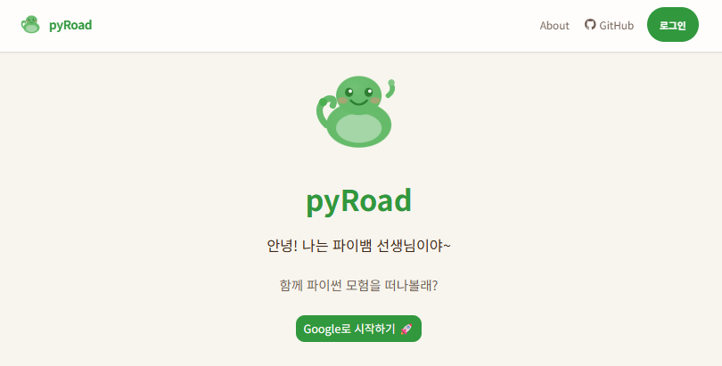
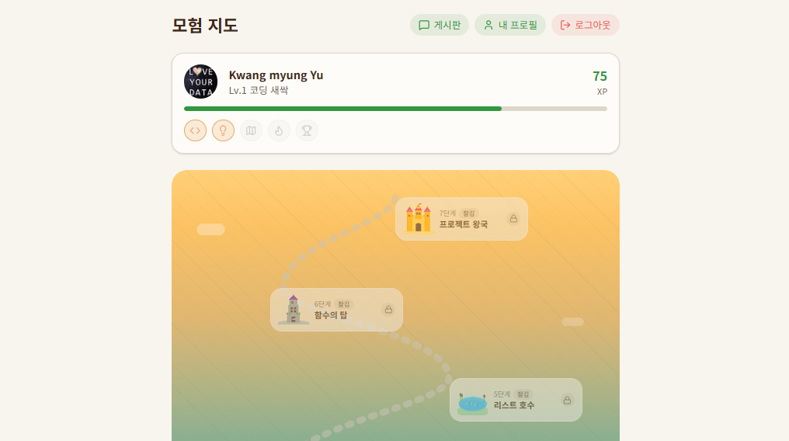
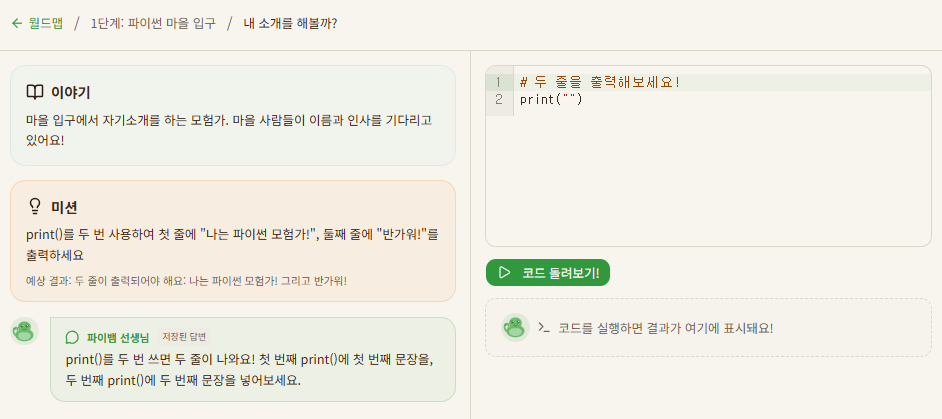

# pyRoad


pyRoad is an interactive Python learning platform for elementary school students. It combines a quest-based curriculum, an AI animal tutor, and in-browser Python execution so learners can start coding without installing a local environment.

For the Korean version of this document, see [docs/README(kr).md](docs/README%28kr%29.md).

## Overview

- Korean-first Python learning experience designed for young learners
- Browser-based coding powered by Pyodide
- World map and quest progression structure
- AI tutor support for introductions and step-by-step hints

## Screenshots

### Landing Page


### World Map


### Learning Page


## Features

- **Google Login** — One-click authentication via Supabase Auth
- **World Map Progression** — Stage-based curriculum with visual progress tracking
- **Quest System** — Step-by-step coding challenges with clear goals
- **AI Animal Tutor** — Claude-powered tutor that introduces topics and provides hints
- **In-Browser Python** — Code execution via Pyodide without any local setup
- **Code Editor** — CodeMirror 6 with Python syntax highlighting
- **Gamification** — Badges, XP, and rewards to keep learners motivated
- **Responsive UI** — Optimized for both desktop and tablet screens

## Tech Stack

- Framework: `Next.js 15`, `React 19`, `TypeScript`
- Styling: `Tailwind CSS v4`
- Auth / Database: `Supabase`
- AI Tutor: `Anthropic SDK`
- Python Runtime: `Pyodide`
- Editor: `CodeMirror 6`
- Animation: `Framer Motion`, `canvas-confetti`
- Tooling: `ESLint`, `Vitest`, `Playwright`

## Project Structure

```
src/
├── app/                  # Next.js App Router pages & API routes
│   ├── (protected)/      # Authenticated routes (world, quest, profile, ...)
│   ├── api/              # API endpoints (AI tutor, progress, ...)
│   └── auth/             # Auth callback
├── components/           # Shared UI components
└── lib/                  # Utilities, Supabase client, Pyodide helpers
```

## Getting Started

### 1. Requirements

- Recent Node.js LTS
- A Supabase project
- Google OAuth configured in Supabase Auth
- An Anthropic API key

### 2. Install dependencies

```bash
npm install
```

### 3. Configure environment variables

Create `.env` based on `.env.example`.

```env
# Supabase
NEXT_PUBLIC_SUPABASE_URL=
NEXT_PUBLIC_SUPABASE_ANON_KEY=
SUPABASE_SERVICE_ROLE_KEY=

# Anthropic
ANTHROPIC_API_KEY=
ANTHROPIC_MODEL=claude-sonnet-4-6
```

### 4. Apply Supabase schema and seed data

This repository includes:

- `supabase/migrations/00001_v0.1.0_initial_schema.sql`
- `supabase/seed.sql`

Apply the migrations and seed data to prepare the database tables.

### 5. Run the development server

```bash
npm run dev
```

The default local URL is `http://localhost:3000`.

## Direction

The goal of pyRoad is to make a child's first Python experience simple, playful, and immediately rewarding. The current repository already includes the core MVP foundation for authentication, world progression, quest UI, AI tutor interaction, and browser-based Python execution.

## Contributing

Contributions are welcome! Please open an issue first to discuss what you would like to change. For major changes, create a feature branch and submit a pull request.

## License

This project is licensed under the [Apache License 2.0](LICENSE).
